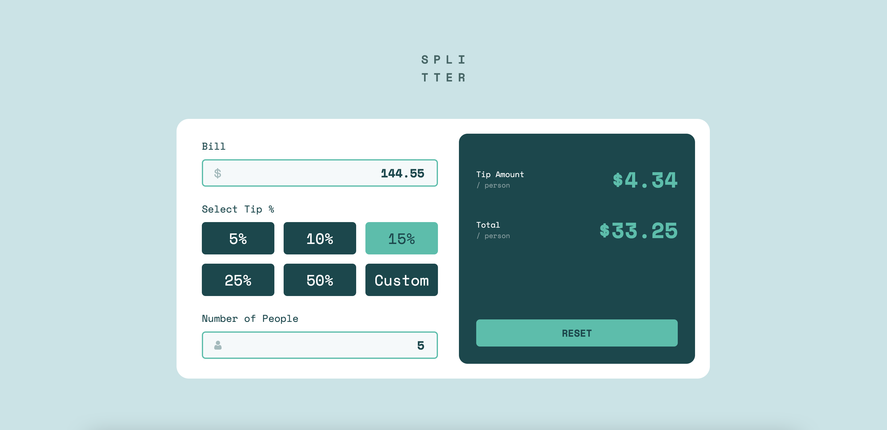

# Frontend Mentor - Tip calculator app solution

This is a solution to the [Tip calculator app challenge on Frontend Mentor](https://www.frontendmentor.io/challenges/tip-calculator-app-ugJNGbJUX). Frontend Mentor challenges help you improve your coding skills by building realistic projects.

## Table of contents

- [Overview](#overview)
  - [The challenge](#the-challenge)
  - [Screenshot](#screenshot)
  - [Links](#links)
- [My process](#my-process)
  - [Built with](#built-with)
  - [What I learned](#what-i-learned)
  - [Continued development](#continued-development)
- [Author](#author)

## Overview

### The challenge

Users should be able to:

- View the optimal layout for the app depending on their device's screen size
- See hover states for all interactive elements on the page
- Calculate the correct tip and total cost of the bill per person

### Screenshot



### Links

- Solution URL: [https://www.frontendmentor.io/solutions/tip-calculator-app-using-scss-kq1TKTIEfY](https://www.frontendmentor.io/solutions/tip-calculator-app-using-scss-kq1TKTIEfY)
- Live Site URL: [https://coder-txane.github.io/tip-calculator-app-main/](https://coder-txane.github.io/tip-calculator-app-main/)

## My process

### Built with

- Semantic HTML5 markup
- CSS custom properties
- Flexbox
- CSS Grid
- Mobile-first workflow
- SCSS
- JavaScript

### What I learned

In this challenge, I learned how important it is to arrange your code from top to bottom. I came across a lot of issues in relation to making the calculator work in JavaScript. I had an idea of what needed to be done but struggled to make the custom button with the other radio buttons. Eventually, after lots of research from online resources like YouTube, I finally managed to solve this by using a ternary operator to switch the tip percentage value if the custom input is chosen.

```js
const selectedTipButton = Array.from(tip).find(button => button.checked);
const tipPercentage = selectedTipButton ? parseFloat(selectedTipButton.value) / 100 : parseFloat(custom.value) / 100;

const tipAmountValue = billValue * tipPercentage / peopleValue;
const totalCostValue = billValue / peopleValue + tipAmountValue;
```

### Continued development

Areas for improvement:
- Functions
- Ternary Operators

## Author

- Frontend Mentor - [@coder-txane](https://www.frontendmentor.io/profile/coder-txane)